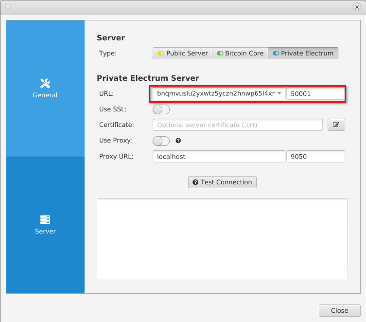
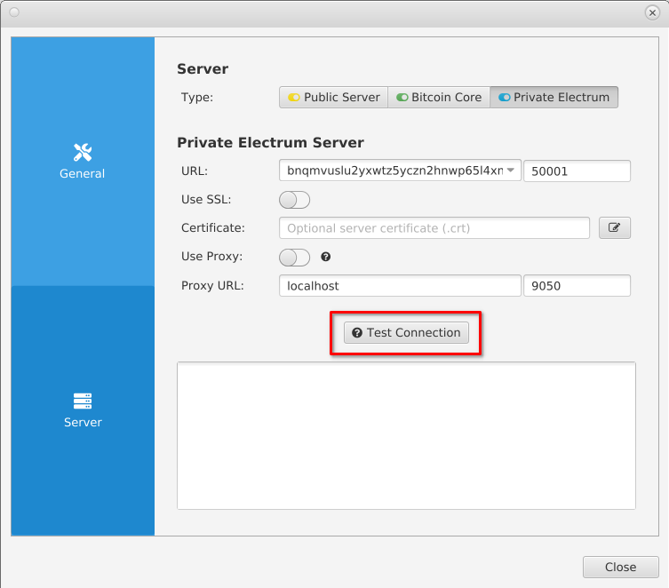
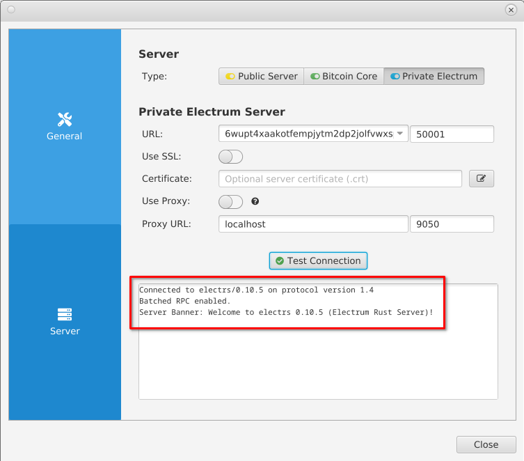

# Sparrow Integration Setup

1. Open Sparrow and go to "File -> Preferences -> Server" or if you are running Sparrow for the first time, proceed through the introduction until the screen below. Then select "Configure Server":

   

1. On the following screen, select "Private Electrum Server":

   

1. Enter your electrs Hostname and Port (found in StartOS's electrs service page, under "Properties"):

   

1. Click "Test Connection":

   

1. You should see the success message below, then you may return to your wallet by pressing "Close", or proceed to "Create New Wallet" if you haven't done so yet:

   
